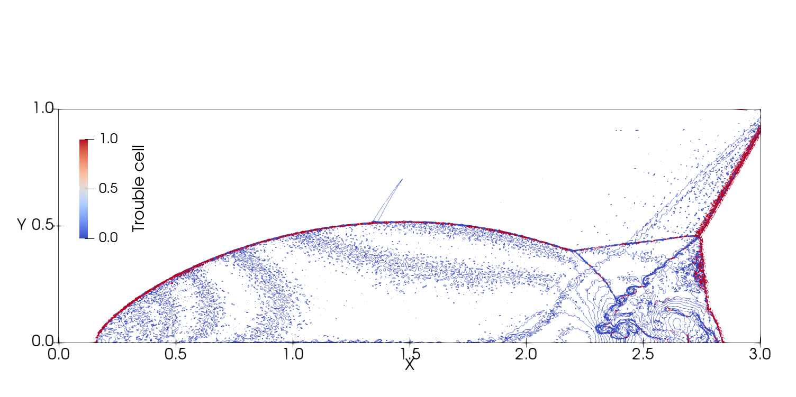
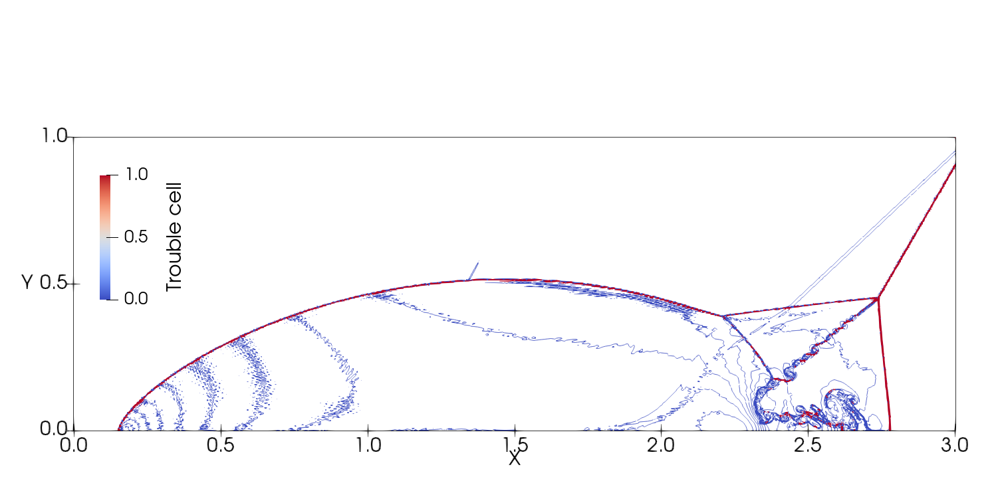
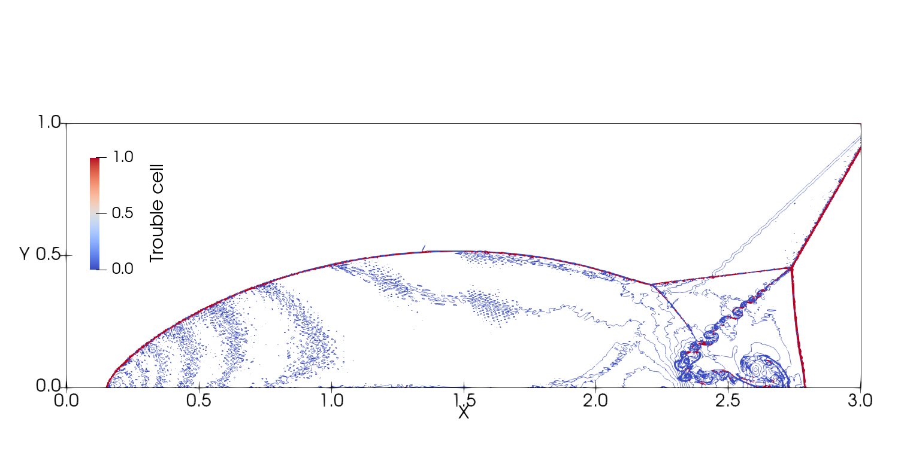

# 2022-03-31

Investigate the 3 WENO limiters and the parameters of PWENO limiter in the DMR and SVI cases.

## DMR

Conclusions are as follows,

- MWENO and PWENO are good and comparable to each other, SWENO shows big oscillations
- PWENO has adjustable parameters and they indeed show differences while MWENO does not have adjustable parameters
- The higher value of `KTrunc` shows more dissipations while `Keps` does not show much differences
- MWENO shows less oscillations after the shock while achieves the same resolution in the vortex region as PWENO

Summary of cases are as follows,

| grid | run | p | limiter                    | SP  | correction function | shock sensor  | time step |
|------|-----|---|----------------------------|-----|---------------------|---------------|-----------|
| 3    | 6   | 2 | SWENO                      | LGL | gDG                 | KXRCF,Ck=1E-2 | 1E-4      |
| 3    | 6   | 2 | SWENO                      | LGL | gDG                 | KXRCF,Ck=1E-2 | 1E-5      |
| 3    | 6   | 2 | MWENO                      | LGL | gDG                 | KXRCF,Ck=1E-2 | 1E-5      |
| 3    | 6   | 2 | PWENO,Ktrunc=2,Keps=1E-2   | LGL | gDG                 | KXRCF,Ck=1E-2 | 1E-5      |
| 3    | 6   | 2 | SWENO                      | LGL | gDG                 | KXRCF,Ck=1E-2 | CFL=0.3   |
| 3    | 6   | 2 | MWENO                      | LGL | gDG                 | KXRCF,Ck=1E-2 | CFL=0.3   |
| 3    | 6   | 2 | PWENO,Ktrunc=2,Keps=1E-2   | LGL | gDG                 | KXRCF,Ck=1E-2 | CFL=0.3   |
| 3    | 6   | 2 | PWENO,Ktrunc=1E6,Keps=1E-2 | LGL | gDG                 | KXRCF,Ck=1E-2 | 1E-5      |
| 3    | 6   | 2 | PWENO,Ktrunc=2,Keps=1E-9   | LGL | gDG                 | KXRCF,Ck=1E-2 | 1E-5      |
| 2    | 11  | 2 | SWENO                      | LGL | gDG                 | KXRCF,Ck=1E-2 | CFL=0.15  |
| 2    | 11  | 2 | MWENO                      | LGL | gDG                 | KXRCF,Ck=1E-2 | CFL=0.15  |
| 2    | 11  | 2 | PWENO,Ktrunc=2,Keps=1E-2   | LGL | gDG                 | KXRCF,Ck=1E-2 | CFL=0.15  |
| 4    | 13  | 2 | SWENO                      | LGL | gDG                 | KXRCF,Ck=1E-2 | CFL=0.15  |
| 4    | 13  | 2 | MWENO                      | LGL | gDG                 | KXRCF,Ck=1E-2 | CFL=0.15  |
| 4    | 13  | 2 | PWENO,Ktrunc=2,Keps=1E-2   | LGL | gDG                 | KXRCF,Ck=1E-2 | CFL=0.15  |

On the grid `480x120`(grid03), compare the SWENO, PWENO, MWENO limiter.
Use

- the KXRCF shock sensor with $C_k=0.01$
- the correction function is `gDG`
- SP is Legendre-Gauss-Lobatto
- P2
- SSP-RK3

On the grid02(`960x240`), compare SWENO, MWENO and PWENO(`KTrunc=2,Keps=1E-2`) using `CFL=0.15(dt=[0.5E-5,1E-5])`.

:::::: {.columns}
::: {.column width='33%'}

:::
::: {.column width='33%'}

:::
::: {.column width='33%'}

:::
::::::

